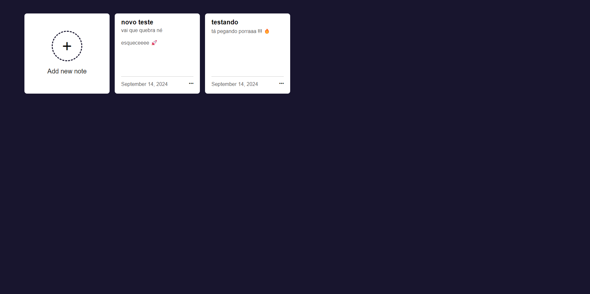

# To-Do App com Docker Compose

Este é um aplicativo de lista de tarefas (To-Do) fullstack que utiliza Docker Compose para configurar e rodar um ambiente completo com Node.js.

## Como Rodar a Aplicação

Para iniciar a aplicação, siga os passos abaixo:

Crie um arquivo `.env` na raiz do projeto com as variáveis necessárias

1. **Construa e inicie os containers**:
   ```bash
   docker compose up --build
   ```


